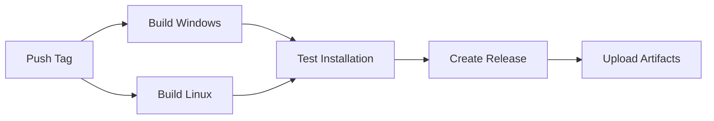

# Build and Deployment Guide

This guide explains how to build and deploy ArtNetController for Windows and Raspberry Pi from a shared codebase.

## Table of Contents

- [Overview](#overview)
- [Requirements](#requirements)
- [Local Build](#local-build)
  - [Windows Build](#windows-build)
  - [Raspberry Pi Build](#raspberry-pi-build)
- [Automated Build (GitHub Actions)](#automated-build-github-actions)
- [Testing](#testing)
- [Troubleshooting](#troubleshooting)

---

## Overview

ArtNetController uses a **single codebase** for both Windows and Raspberry Pi platforms:

- **Windows**: PyInstaller creates standalone `.exe` with optional Inno Setup installer
- **Raspberry Pi**: Native `.deb` package with systemd service

### Build Outputs

| Platform | Files | Size |
|----------|-------|------|
| Windows | `ArtNetController-2.0.0-Setup.exe` | ~50 MB |
| Windows | `ArtNetController-2.0.0-Portable.zip` | ~45 MB |
| Raspberry Pi | `artnetcontroller_2.0.0_armhf.deb` | ~30 MB |

---

## Requirements

### Common Requirements

- Python 3.9 or later
- Git

### Windows Requirements

```powershell
# Install Python packages
pip install -r requirements.txt
pip install pyinstaller

# Optional: Inno Setup for installer creation
# Download from: https://jrsoftware.org/isdl.php
```

### Raspberry Pi Requirements

```bash
# Install build tools
sudo apt-get update
sudo apt-get install -y python3-pip python3-venv dpkg-dev

# Install Python packages
pip3 install -r requirements.txt
```

---

## Local Build

### Windows Build

#### Quick Build

```powershell
# Build everything (exe + portable + installer)
python build_windows.py
```

Output files will be in `dist/`:
- `ArtNetController-2.0.0-Setup.exe` - Full installer
- `ArtNetController-2.0.0-Portable.zip` - Portable version
- `SHA256SUMS.txt` - Checksums

#### Manual Build (Advanced)

```powershell
# 1. Build executable only
pyinstaller build\ArtNetController.spec

# 2. Create portable package manually
cd dist
Compress-Archive -Path ArtNetController -DestinationPath ArtNetController-Portable.zip

# 3. Create installer with Inno Setup (if installed)
iscc build\ArtNetController.iss
```

#### Build Options

Edit `build_windows.py` to customize:

```python
# Application info
APP_NAME = "ArtNetController"
APP_VERSION = "2.0.0"

# PyInstaller spec file
SPEC_FILE = BUILD_DIR / f"{APP_NAME}.spec"
```

Edit `build/ArtNetController.spec` for advanced settings:

```python
# Exclude packages to reduce size
excludes = ['matplotlib', 'numpy', 'scipy', 'pandas']

# Add hidden imports if needed
hiddenimports = ['PyQt6', 'psutil']

# Enable/disable UPX compression
upx = True
```

### Raspberry Pi Build

#### Quick Build

```bash
# Build .deb package
python3 build_raspberry.py
```

Output files will be in `dist/`:
- `artnetcontroller_2.0.0_armhf.deb` - Debian package
- `artnetcontroller_2.0.0_armhf.sha256` - Checksum

#### Manual Build (Advanced)

```bash
# 1. Create package structure
mkdir -p build_deb/DEBIAN
mkdir -p build_deb/usr/local/bin

# 2. Copy application files
cp -r src build_deb/usr/local/lib/artnetcontroller/

# 3. Create control file
cat > build_deb/DEBIAN/control << EOF
Package: artnetcontroller
Version: 2.0.0
Architecture: armhf
Depends: python3, python3-pyqt6, python3-psutil
Maintainer: Your Name <email@example.com>
Description: Professional DMX Art-Net Controller
EOF

# 4. Build package
dpkg-deb --build --root-owner-group build_deb dist/artnetcontroller_2.0.0_armhf.deb
```

#### Installation Testing

```bash
# Install package
sudo dpkg -i dist/artnetcontroller_2.0.0_armhf.deb

# Fix dependencies if needed
sudo apt-get install -f

# Test application
artnetcontroller

# Test systemd service
sudo systemctl start artnetcontroller
sudo systemctl status artnetcontroller
```

---

## Automated Build (GitHub Actions)

### Setup

1. **Enable GitHub Actions** in your repository:
   - Go to Settings → Actions → General
   - Select "Allow all actions and reusable workflows"

2. **Workflow file** is already created: `.github/workflows/build.yml`

### Trigger Build

#### Method 1: Git Tag (Recommended)

```bash
# Create and push version tag
git tag -a v2.0.0 -m "Release version 2.0.0"
git push origin v2.0.0
```

This will:
1. Build Windows and Linux packages
2. Run tests
3. Create GitHub Release
4. Upload all artifacts

#### Method 2: Manual Trigger

1. Go to Actions tab in GitHub
2. Select "Build and Release" workflow
3. Click "Run workflow"
4. Choose branch and click "Run"

### Workflow Stages



### Build Status

Check build status at:
```
https://github.com/YOUR_USERNAME/ArtNetController/actions
```

### Release Output

After successful build, GitHub Release will contain:

```
v2.0.0
├── ArtNetController-2.0.0-Setup.exe
├── ArtNetController-2.0.0-Portable.zip
├── artnetcontroller_2.0.0_armhf.deb
├── SHA256SUMS.txt
└── Release Notes
```

---

## Testing

### Windows Testing

```powershell
# Test portable version
Expand-Archive dist\ArtNetController-2.0.0-Portable.zip -DestinationPath test
.\test\ArtNetController\ArtNetController.exe

# Test installer (creates Start Menu shortcuts)
.\dist\ArtNetController-2.0.0-Setup.exe /SILENT
```

### Raspberry Pi Testing

```bash
# Install package
sudo dpkg -i dist/artnetcontroller_2.0.0_armhf.deb

# Check files
dpkg -L artnetcontroller

# Test CLI
artnetcontroller --version

# Test service
sudo systemctl start artnetcontroller
sudo systemctl status artnetcontroller
journalctl -u artnetcontroller -f

# Check logs
tail -f /var/log/artnetcontroller/artnet_controller.log
```

### Verify Checksums

```bash
# Windows (PowerShell)
Get-FileHash dist\ArtNetController-2.0.0-Setup.exe -Algorithm SHA256

# Linux
sha256sum dist/artnetcontroller_2.0.0_armhf.deb
```

---

## Troubleshooting

### Windows Build Issues

#### Issue: PyInstaller not found

```powershell
# Solution: Install PyInstaller
pip install pyinstaller
```

#### Issue: Missing DLL errors

```powershell
# Solution: Add to spec file hiddenimports
hiddenimports = ['missing_module']
```

#### Issue: Large executable size

```python
# Solution: Exclude unnecessary packages in spec file
excludes = ['tkinter', 'matplotlib', 'numpy']
```

#### Issue: Antivirus false positive

```powershell
# Solution: Sign executable with code signing certificate
# Or: Add exclusion in antivirus settings
```

### Raspberry Pi Build Issues

#### Issue: dpkg-deb not found

```bash
# Solution: Install dpkg-dev
sudo apt-get install dpkg-dev
```

#### Issue: Python dependencies missing

```bash
# Solution: Install all dependencies
sudo apt-get install python3-pyqt6 python3-psutil

# Or fix after installation
sudo apt-get install -f
```

#### Issue: Service fails to start

```bash
# Check logs
journalctl -u artnetcontroller -n 50

# Common causes:
# 1. Missing DISPLAY variable (fixed in service file)
# 2. Missing permissions (run as root)
# 3. Missing config file (check /etc/artnetcontroller/)
```

### GitHub Actions Issues

#### Issue: Build fails on Actions

```bash
# Check requirements.txt is complete
pip freeze > requirements.txt
git add requirements.txt
git commit -m "Update requirements"
```

#### Issue: Release not created

```bash
# Check tag format (must start with 'v')
git tag v2.0.0  # ✅ Correct
git tag 2.0.0   # ❌ Wrong
```

#### Issue: Permission denied for release creation

```yaml
# Add permissions to workflow
permissions:
  contents: write
```

---

## Build Configuration

### Version Management

Update version in multiple files:

1. **src/system/__init__.py**
   ```python
   __version__ = '2.0.0'
   ```

2. **build_windows.py**
   ```python
   APP_VERSION = "2.0.0"
   ```

3. **build_raspberry.py**
   ```python
   APP_VERSION = "2.0.0"
   ```

4. **build/ArtNetController.spec**
   ```python
   APP_VERSION = '2.0.0'
   ```

5. **build/version_info.txt**
   ```
   FileVersion='2.0.0.0'
   ```

### Customization

#### Change Application Name

```python
# In all build scripts
APP_NAME = "YourAppName"
```

#### Change Maintainer Info

```python
# build_raspberry.py
MAINTAINER = "Your Name <your@email.com>"
HOMEPAGE = "https://yourwebsite.com"
```

#### Add More Files

```python
# build/ArtNetController.spec
datas = [
    ('config.json', '.'),
    ('assets', 'assets'),
    ('docs', 'docs'),  # Add this
]
```

---

## Distribution

### Manual Distribution

1. **Upload to GitHub Releases**
   - Go to Releases → Create new release
   - Upload files from `dist/`
   - Add release notes

2. **Direct Download**
   - Host on web server
   - Share download links

### Automatic Distribution

GitHub Actions automatically:
1. Builds on tag push
2. Creates GitHub Release
3. Uploads all artifacts
4. Generates release notes

---

## Best Practices

### Before Building

- ✅ Update version numbers
- ✅ Test application locally
- ✅ Update CHANGELOG.md
- ✅ Commit all changes
- ✅ Create git tag

### After Building

- ✅ Test installers on clean systems
- ✅ Verify checksums
- ✅ Check file sizes
- ✅ Test auto-update functionality
- ✅ Document known issues

### Security

- 🔐 Sign Windows executables with code signing certificate
- 🔐 Never commit credentials to repository
- 🔐 Use GitHub Secrets for sensitive data
- 🔐 Verify checksums before distribution

---

## Additional Resources

- **PyInstaller Documentation**: https://pyinstaller.org/
- **Inno Setup**: https://jrsoftware.org/isinfo.php
- **Debian Packaging**: https://www.debian.org/doc/manuals/maint-guide/
- **GitHub Actions**: https://docs.github.com/en/actions

---

## Support

For build issues:
1. Check [Troubleshooting](#troubleshooting) section
2. Search existing [GitHub Issues](https://github.com/YOUR_USERNAME/ArtNetController/issues)
3. Create new issue with build logs

---

**Last Updated**: 2025-01-XX  
**Build System Version**: 2.0.0
